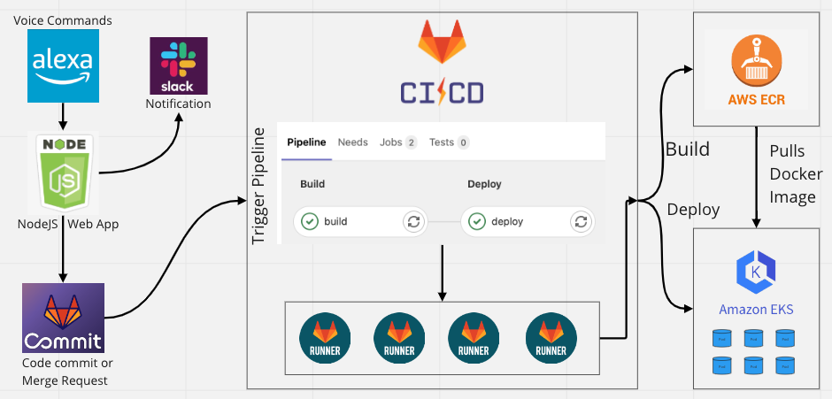
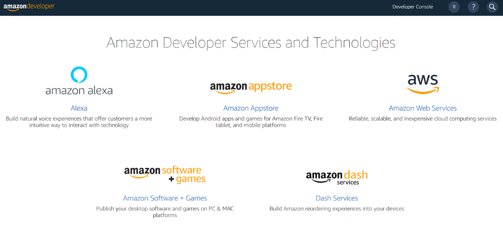
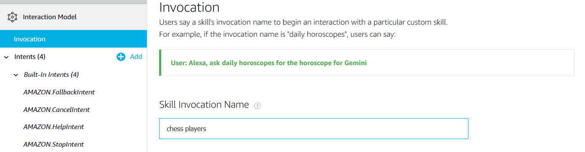
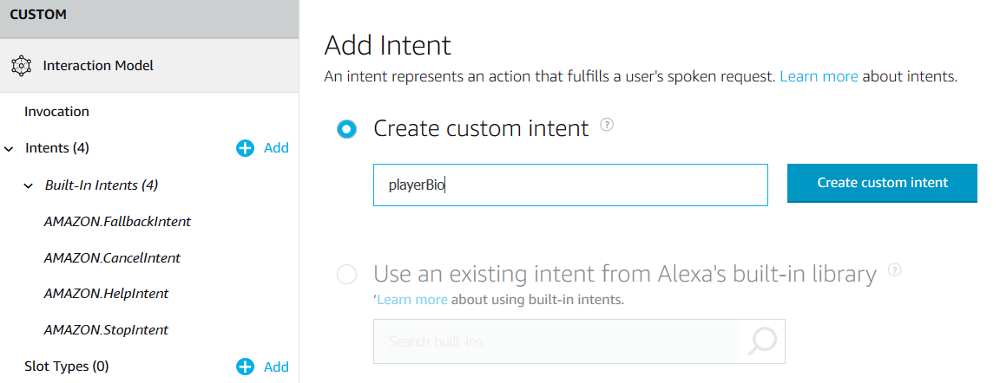
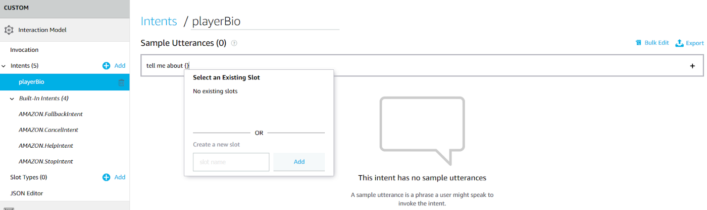
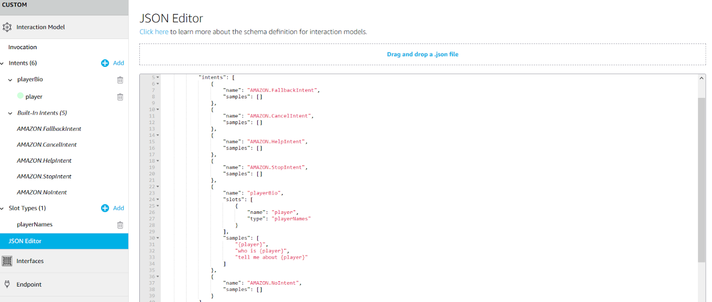
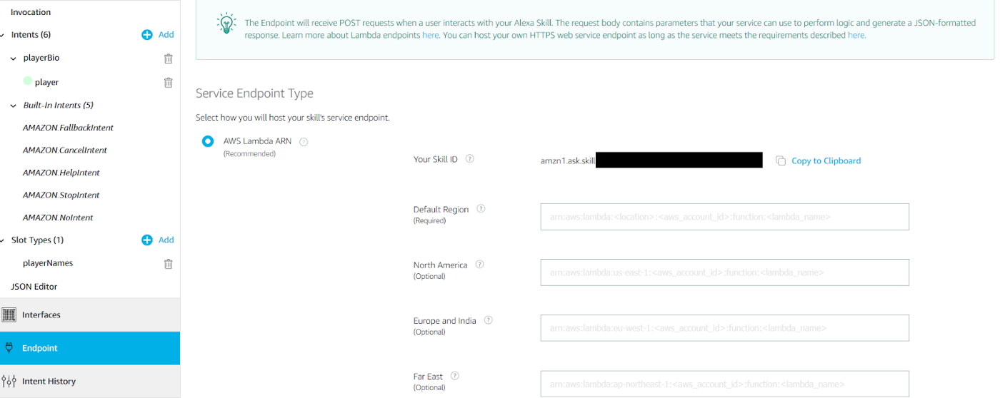
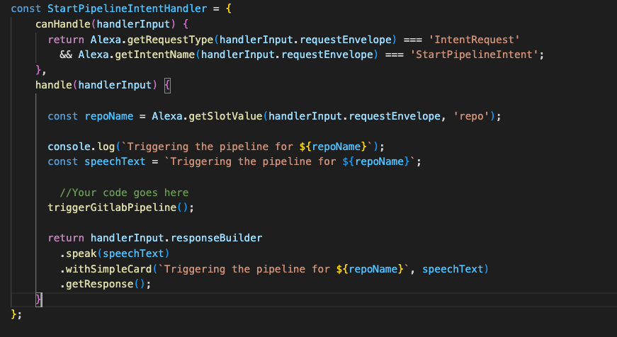
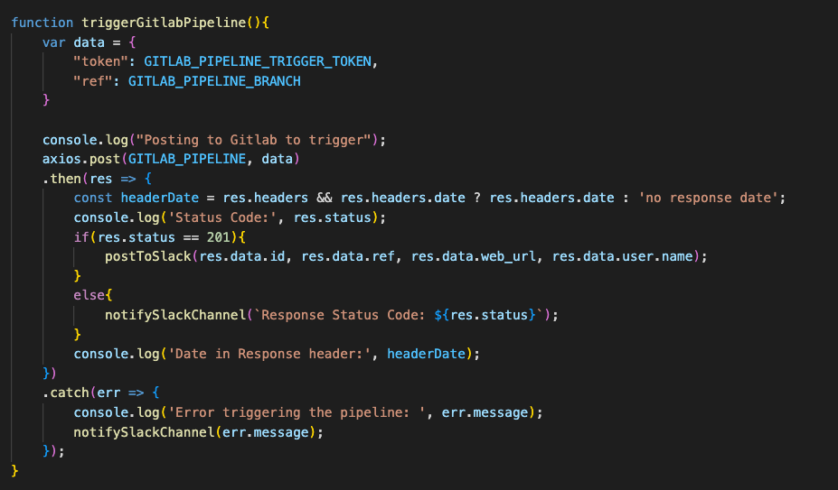

# alexa-nodejs

## ServiceMap/ Architecture Design

## Creating a Skill on Alexa Developer Console
### Prerequisites: 
1. The skill interface is implemented within the Amazon Alexa developers platform. So you’ll need an Amazon Developers Services (ADS) account in order to build the skill and its interaction model.
    1. Sign in to your ADS account and choose Alexa 

    2. Click Alexa Skills kit
    3. Create Skill 
    4. Enter any name in the “Skill name field”, and select “Custom”. 
    5. Click the “Create a skill” button.
### Part1: 
1. Building the Interaction Model
    1. This model opens an interface to interact with the alexa.
    2. It contains -> invocation name, intents and utterances which are equivalent to Launch, Triggering an event after the launch, and voice commands to invoke the intent [event] respectively.
    3. On the left side navigation bar, Select the “Invocation” tab.
        1. Enter <name> in the “Skill Invocation Name” field. 
    4. Brief background on Intents and Utterances:
        1. Intent is an Alexa term for triggering an event with our voice commands. 
        2. Every skill can have many intents 
            1. For Example: In our case, we have a intent for triggering the pipeline which on invocation through voice commands, send a request to Alexa backend and triggers the pipeline.
        3. Alexa Skills Kit (ASK) Library provides some predefined Built-in intents that we can use or we can create new intents too.
        4. Intents have utterances
        1. Utterances are voice commands to invoke an intent.
        3. For Example: "Run the gitlab pipeline" | "Run the pipeline" | "Start the gitlab pipeline"
        4. These are multiple utterances with slight variation but invokes a single target intent.
        5.  Note: Built-in intents have built-in utterances. It is possible to extend the number of existing utterances by adding new utterances. When a skill is created, four built-in intents are added to the Interaction model by default. These are: AMAZON.HelpIntent, AMAZON.CancelIntent, AMAZON.FallbackIntent and AMAZON.StopIntent.
    6. To create a custom intent:
        1. Click the “Add” sign near the “Intents” tab.
        2. Select “Custom Intent”.
        3. Enter <intent_name> in the field below.
        4. Click the “Create custom intent” button.
        
    7. To create an utterance:
        1. Select the <your_newly_created_intent> tab.
        2. Enter the utterance text in the “Sample Utterances” filed in the form of “tell me about {}”.
        
        3. Create a new slot in the window, which pops up when “{}” is entered, by entering “player” in the “Create a new slot” 
        field and by clicking the “Add” button.
            1. Slots are equivalent to Alexa's variables.
            2. Examples:
                1. tell me about *baseball*
                2. tell me about *greece*
        4. Click the “plus” sign at the right end of the “Sample Utterances” field.
    8. Now save the model by clicking the “Save Model” button, and build it by clicking the “Build Model” button.
2. Interaction Model Schema
    1. Every interaction model has its interaction model schema, which can be accessed by selecting the “JSON Editor” tab. The interaction model schema, written in a json file, contains intents, utterances, slots, i.e. everything that is implemented within the interaction model.
    2. Build our interaction model from a JSON file.
        1. The entire interaction model can be built directly by writing a bit of json code in the “JSON Editor” or by uploading a json file.
    
3. Choose the End points
    1. Since we are done with our interface, now we code our implementation in the form of a user implemented web service or the AWS service. This is configured in the “Endpoints”.
    2. For our skill, we are going to use the node js web service [it can also be a AWS Lambda Function ], which communicates with the skill interface via our nodejs web service.
    3. To choose the AWS service:
        1. Click the “Endpoints” tab.
        2. Select the “HTTPS” option.
            1. Add the URL of your web app in the slot and select the certficate type based on your configuration.
        3. Now Alexa will be able to recognise the voice commands, sends them to your web service as JSON requests, which inturn invokes appropriate IntentHandler method in your web service.
    
---
## Create a NodeJs application:
1. Follow the procedure detailed in the official documentation: 
[Setting up a web service](https://developer.amazon.com/en-US/docs/alexa/alexa-skills-kit-sdk-for-nodejs/host-web-service.html).
    1. You can either create a nodejs hosted on AWS lambda or a local web application and the detailed process is here: [Build your Alexa Service](https://developer.amazon.com/en-US/docs/alexa/alexa-skills-kit-sdk-for-nodejs/develop-your-first-skill.html)
    2. Note that if you are using a user implemented web service, then you should host/deploy the application on the cloud/kubernetes
    3. Add the URL to the "HTTPS" section of the "Endpoints" tab in the Alexa Developer Console. 
2. Custom Intent Handler
    1. This link [Build your Alexa Service](https://developer.amazon.com/en-US/docs/alexa/alexa-skills-kit-sdk-for-nodejs/develop-your-first-skill.html) helps getting started with the code, and you can modify the functions to work according to your needs.
3. You can test the end points using the TEST tab on the top navigation bar in the Alexa Developer Console
4. You can also test the whole application by invoking intents through utterances.
---
## Make post requests to Slack and Gitlab Webhooks
1. Below is picture of the CustomIntentHanlder in the nodejs application
    
    